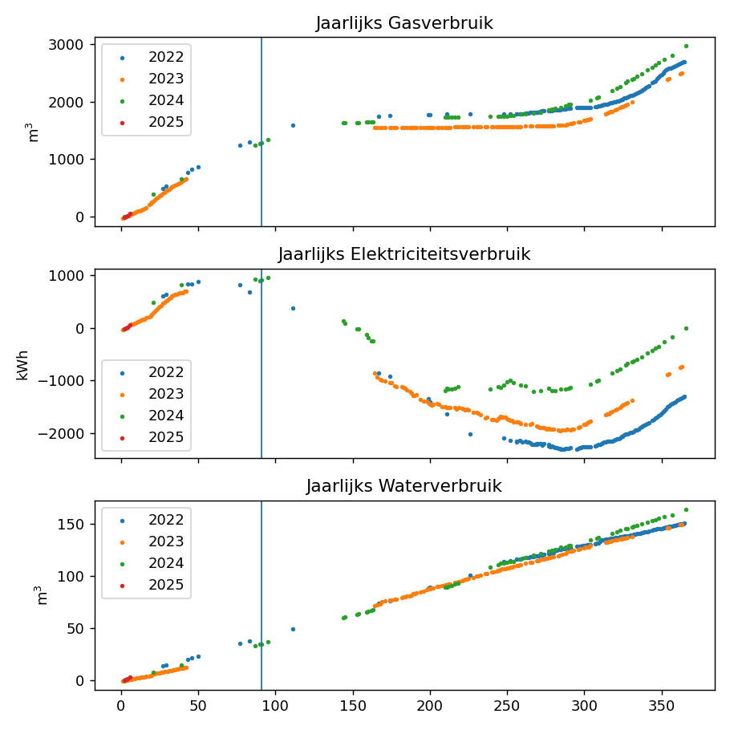

# Plot en inspecteer de meterstanden van elektriciteit, water en gas

Deze Python code leest een CSV bestand uit de `data` folder en maakt verschillende figuren om het verloop van het verbruik van elektriciteit, water en gas op te volgen.

Het data bestand meterstanden.csv wordt elke dag aangevuld door het trekken van fotootjes van de meters en dit in de file aan te vullen. Het plan was om dit te automatiseren, maar daar is geen tijd voor.

Deze repo was tevens een poging om verschillende python bibliotheken te leren kennen, nl. Matplotlib, Pandas, Bokeh, en zelf Holoview. ook dat is niet meer onderhouden.

De Notebook directory bevat de code om de plots te maken in een Jupiter notebook. De meest recente versie is de combinatie bokeh en pandas.

De `src` directory bevat code die op de commando lijn kan worden uitgevoerd. De meest recente versie hier is de overlap.py die enkel op Mac/Linux kan worden uitgevoerd en die gebruik maakt van Qt5.

```
$ cd ~/github/scatter/metrics/home/meterstanden/
$ python src/overlap.py
```


