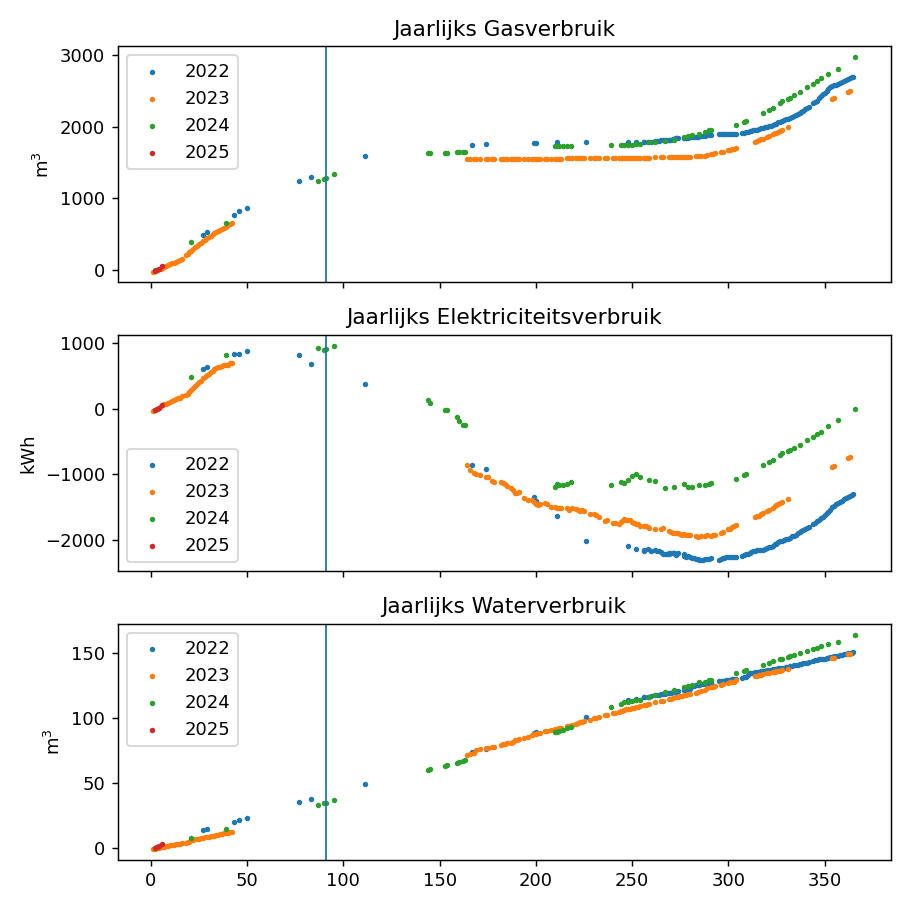

# Plot and inspect the meter readings of electricity, water, and gas

This Python code reads a CSV file from the data folder and creates various figures to track the consumption of electricity, water, and gas.

The data file `meterstanden.csv` is updated daily by taking photos of the meters and adding them to the file. The plan was to automate this, but there is no time for that.

This repository was also an attempt to get to know various Python libraries, namely Matplotlib, Pandas, Bokeh, and even Holoview. This is no longer maintained.

The `notebook` directory contains the code to create the plots in a Jupyter notebook. The most recent version is the combination of Bokeh and Pandas. Also not maintained anymore.

The `src` directory contains code that can be executed from the command line. The most recent version here is `overlap.py`, which can only be run on Mac/Linux and uses Qt5.

```
$ cd ~/github/scatter/metrics/home/meterstanden/
$ python src/overlap.py
```


